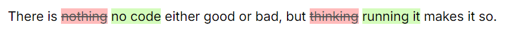

# carta-plugin-ins-del

`<ins>` and `<del>` tags support for [Carta](https://github.com/BearToCode/carta).

## Installation

```shell
npm i carta-plugin-ins-del
```

## Setup

### Styles

No default style are applied, you need to apply your own.  
Example custom styles:

```css
.markdown-body ins {
	text-decoration: none;
	background-color: #d4fcbc;
}

.markdown-body del {
	text-decoration: line-through;
	background-color: #fbb;
	color: #555;
}
```

### Extension

```svelte
<script>
	import { Carta, CartaEditor } from 'carta-md';
	import { insdel } from 'carta-plugin-ins-del';

	const carta = new Carta({
		extensions: [insdel()],
	});
</script>

<CartaEditor {carta} />
```

## Usage

This snippet:

```
There is --nothing-- ++no code++ either good or bad, but --thinking-- ++running it++ makes it so.
```

will generate this output:


